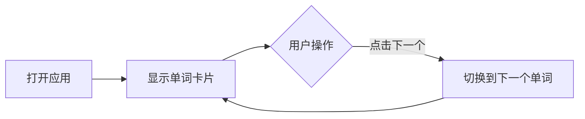

## 1. Product Overview
简洁的背单词词卡应用，帮助用户高效记忆英语单词。
- 提供清晰的单词展示界面，包含单词、音标、含义，支持翻页切换和词典API集成
- 为英语学习者提供直观、高效的单词记忆工具

## 2. Core Features

### 2.2 Feature Module
1. **词卡主页**: 单词展示、翻页功能、预设单词数据
2. **词典查询**: 集成在线词典API（可选扩展）

### 2.3 Page Details
| Page Name | Module Name | Feature description |
|-----------|-------------|---------------------|
| 词卡主页 | 单词展示 | 显示单词、音标、中文含义，设计简洁优雅 |
| 词卡主页 | 翻页功能 | 点击按钮或键盘切换下一个单词 |
| 词卡主页 | 预设数据 | 内置3个示例单词作为初始数据 |

## 3. Core Process
用户打开应用 → 查看当前单词卡片 → 点击"下一个"按钮 → 翻页显示下一个单词

## 4. User Interface Design
### 4.1 Design Style
- 主色调：清新的蓝色系（#3B82F6），搭配浅灰色背景（#F8FAFC）
- 辅助色：柔和的绿色（#10B981）表示掌握
- 卡片样式：圆角矩形，轻微阴影，极简设计
- 字体：使用现代无衬线字体，大号单词展示，中号音标，小号释义
- 布局：居中卡片式布局，留白充足
- 交互：平滑的翻页动画，按钮悬停效果

### 4.2 Page Design Overview
| Page Name | Module Name | UI Elements |
|-----------|-------------|-------------|
| 词卡主页 | 单词卡片 | 白色背景、圆角、阴影，居中布局，单词大号字体，音标灰色，释义分多行显示 |
| 词卡主页 | 翻页按钮 | 蓝色渐变按钮，悬停时颜色加深，底部居中布局 |
| 词卡主页 | 进度指示 | 底部显示当前单词序号/总数 |

### 4.3 Responsiveness
移动端优先，适配各种屏幕尺寸，触摸优化

